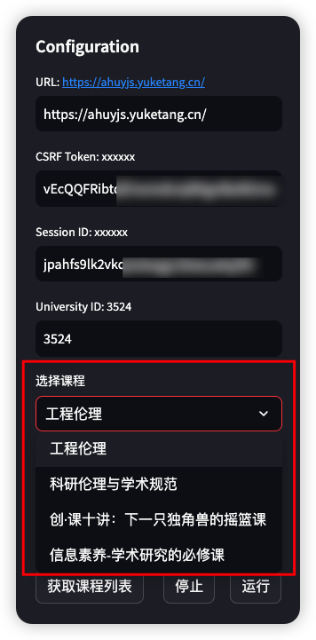
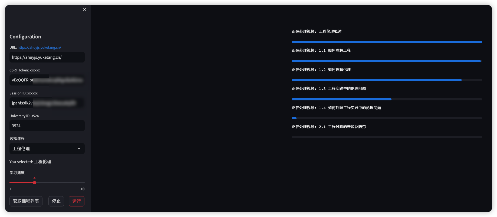

# Get Out of Online Courses

## 介绍

核心刷课代码来自于：https://github.com/heyblackC/yuketangHelper

本项目主要是使用 streamlit 重构了一下，无需本地环境配置，方便使用。

## 使用截图

1. 填写相应内容后，点击<获取课程列表>按钮。
   
    

2. 点击<开始>按钮，即可自动刷课。

    
